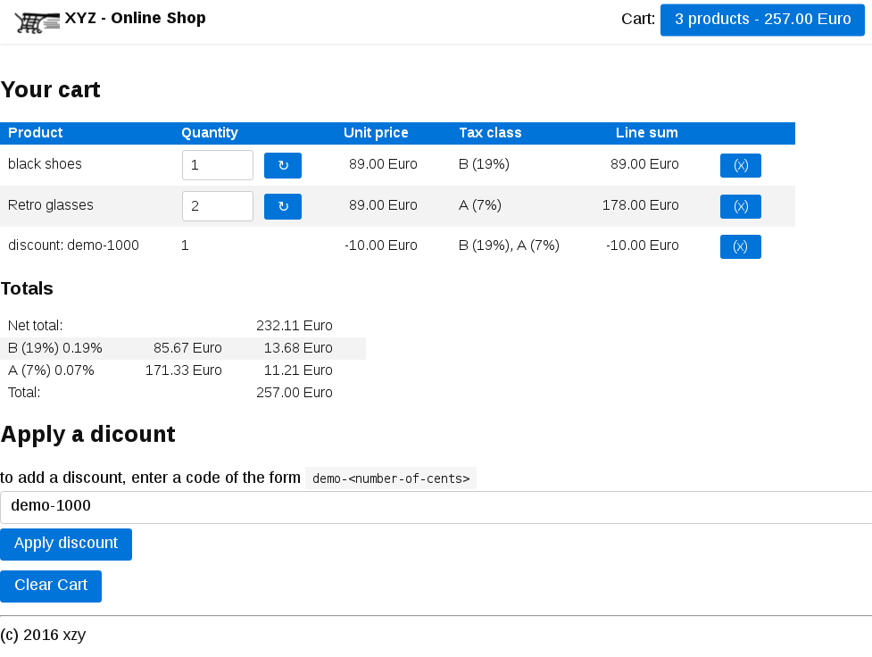

Shopping cart demo app
====

This is a relatively simple shopping cart app written in scalajs.

It uses the [ecommerce calculations library](https://github.com/ckressibucher/ecommerce-calculations)
to do tax calculations.

Screenshot
---

Usage
---

    git clone https://github.com/ckressibucher/ecommerce-calculations.git
    cd ecommerce-calculations
    sbt publishLocal
    cd -
    git clone https://github.com/ckressibucher/ecommerce-demo-app.git
    cd ecommerce-demo-app
    sbt appJVM/run

then see at http://localhost:8080

